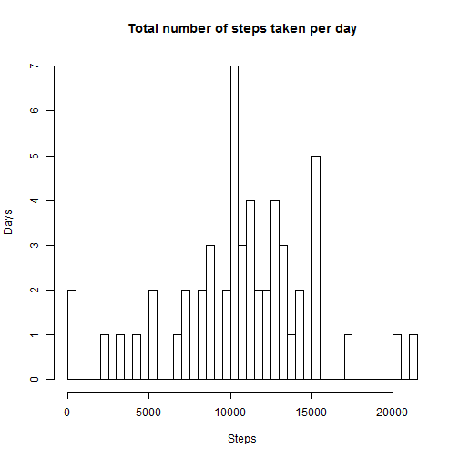
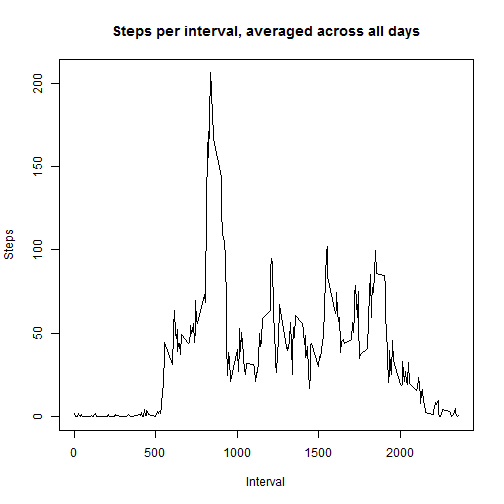
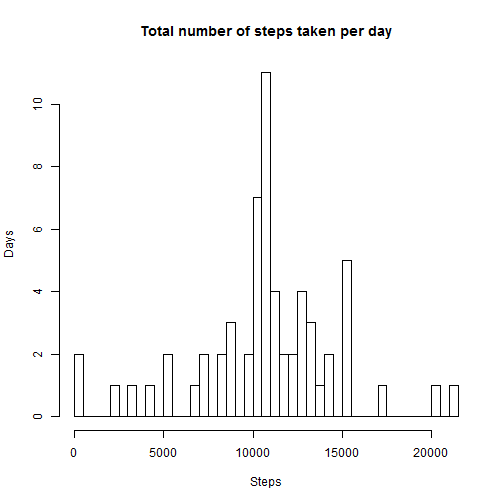
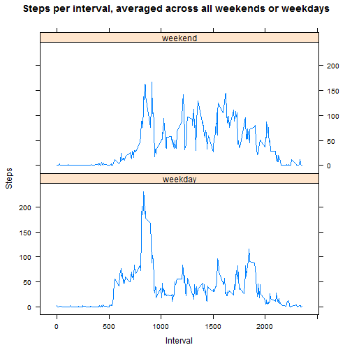

## Loading and preprocessing the data


```r
# unzipping data
unzip("activity.zip", files = NULL, list = FALSE, overwrite = TRUE, junkpaths = FALSE, exdir = ".", unzip = "internal", setTimes = FALSE)

# reading data
activity <- read.csv("activity.csv")

# converting date variable from factor to date class
activity$date <- as.Date(activity$date)
```

## What is mean total number of steps taken per day?


```r
# calculating total number of steps for each day
stepsPerDay <- tapply(activity$steps, activity$date, sum)

# plotting histogram of the total number of stepstaken each day
hist(stepsPerDay, breaks=61, main="Total number of steps taken per day", xlab="Steps", ylab="Days")
```

 

```r
# calculating mean and median of stepsPerDay
meanSteps <- mean(stepsPerDay, na.rm=TRUE)
medianSteps <- median(stepsPerDay, na.rm=TRUE)
```

The mean total number of steps taken per day is $1.0766189 &times; 10<sup>4</sup>$. The median total number of steps taken per day is $10765$.

## What is the average daily activity pattern?


```r
# calculating average number of steps for each interval
stepsPerInterval <- tapply(activity$steps, activity$interval, mean, na.rm=TRUE)

# assigning interval names
intervalName <- unique(activity$interval, incomparables = FALSE)

# plotting stepsPerInterval
plot(intervalName, stepsPerInterval, type="l", main="Steps per interval, averaged across all days", xlab="Interval", ylab="Steps")
```

 

```r
# identifying interval with highest average number of steps
maxInterval <- intervalName[which.max(stepsPerInterval)]
```

The 5-minute interval, on average across all the days in the dataset, that contains the maximum number of steps is $835$.

## Imputing missing values


```r
# identifying NAs
stepsNA <- sum(is.na(activity$steps))
```

The total number of missing values in the dataset is $2304$.


```r
# replacing NAs with mean steps per each interval
for (r in 1:nrow(activity)) {
    if (is.na(activity[r, 1])) {
        activity[r, 1] <- stepsPerInterval[[(r-1)%%288+1]]
    }    
}

# plotting histogram of steps
stepsPerDay2 <- tapply(activity$steps, activity$date, sum)
hist(stepsPerDay2, breaks=61, main="Total number of steps taken per day", xlab="Steps", ylab="Days")
```

 

```r
# calculating mean and median of stepsPerDay2
meanSteps2 <- mean(stepsPerDay2, na.rm=TRUE)
medianSteps2 <- median(stepsPerDay2, na.rm=TRUE)
```

The mean total number of steps taken per day is $1.0766189 &times; 10<sup>4</sup>$. This is identical to the mean when missing values are not imputed.  The median total number of steps taken per day is $1.0766189 &times; 10<sup>4</sup>$. This is greater than the median when missing values are not imputed. The histograms appear to be identical, except for 8 days added to the 12th bar for the imputed dataset. Missing values were imputed using the mean number of steps for the corresponding interval. The effect of this appears to be equivalent to adding 8 average days to the dataset, leaving the mean unchanged. The non-integer imputed values made it possible for the median to be identical to the non-integer mean in this apparently unskewed daily total steps histogram.

## Are there differences in activity patterns between weekdays and weekends?


```r
# assigning factor weekday or weekend according to each date
activity$day <- weekdays(activity$date)
activity$day[activity$day=="Monday"] <- "weekday"
activity$day[activity$day=="Tuesday"] <- "weekday"
activity$day[activity$day=="Wednesday"] <- "weekday"
activity$day[activity$day=="Thursday"] <- "weekday"
activity$day[activity$day=="Friday"] <- "weekday"
activity$day[activity$day=="Saturday"] <- "weekend"
activity$day[activity$day=="Sunday"] <- "weekend"
activity$day <- as.factor(activity$day)

# calculating average number of steps for each interval and day
stepsWeekday <- aggregate(steps ~ interval + day, data = activity, FUN="mean")

# plotting steps per interval for weekend and weekday
library(lattice)
xyplot(steps ~ interval | day, data = stepsWeekday, type = "l", layout = c(1,2), main="Steps per interval, averaged across all weekends or weekdays", xlab="Interval", ylab="Steps")
```

 
